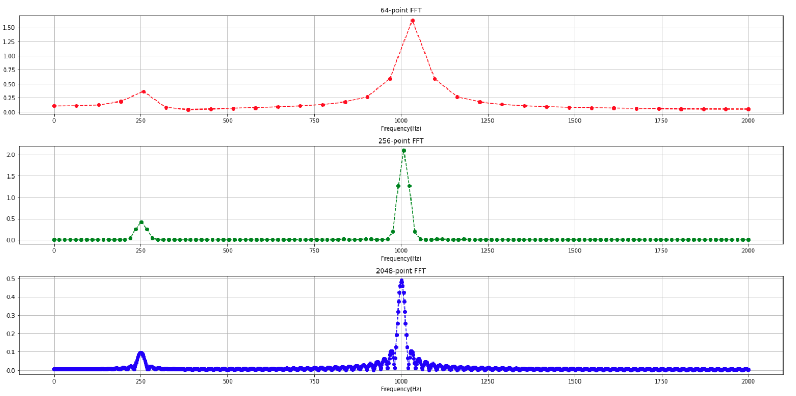
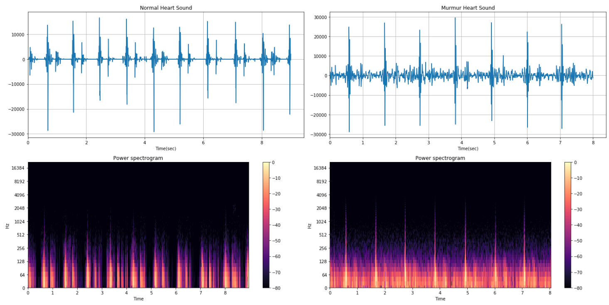
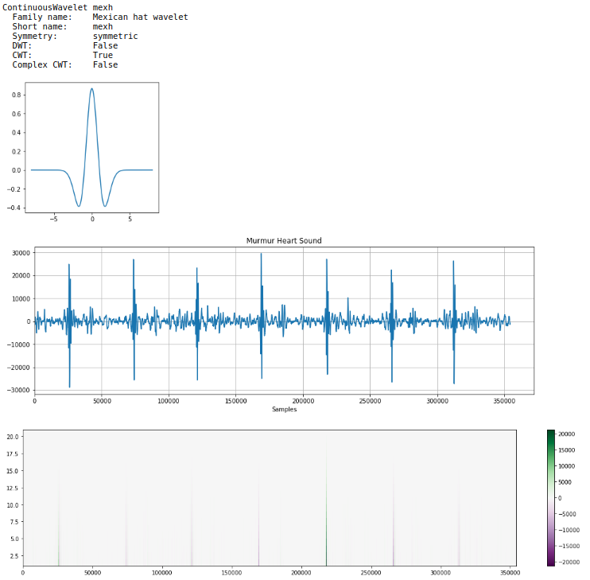
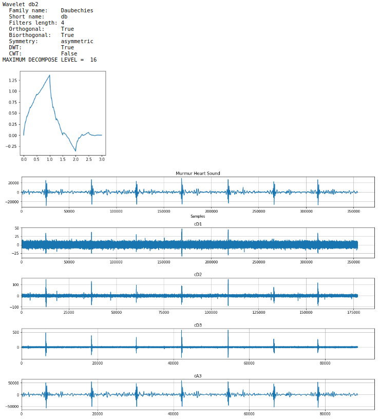

# wavelet101

## Directory information

```
├──docs
├──FFT_STFT_wavelet_101.ipynb   --> Examples for FFT, STFT, CWT and DWT.
├──README.md
├──murmur_201101180902.wav      --> 8-second long abnormal heartsound with murmur.
├──normal_201103101140.wav      --> 9-second long normal heartsound.
  
```
## Examples
* FFT frequency spectrum

* STFT spectrogram

* CWT

* DWT


## Material and prerequisite of wavelet analysis
* FFT zero-padding
<br/>https://dsp.stackexchange.com/questions/741/why-should-i-zero-pad-a-signal-before-taking-the-fourier-transform
<br/>http://www.bitweenie.com/listings/fft-zero-padding/
* Wavelet analysis
<br/>[:star: :star: :star: :star: :star:] http://users.rowan.edu/~polikar/WTtutorial.html
<br/>[in Chinese] https://www.zhihu.com/question/22864189
<br/>[in Chinese] https://blog.csdn.net/jbb0523/article/details/42554693
<br/>[in Chinese] https://blog.csdn.net/jbb0523/article/details/42470103

## API reference
* PyWavelets 
<br/>https://pywavelets.readthedocs.io/en/latest/ref/index.html
* LibROSA
<br/>https://librosa.github.io/librosa/index.html